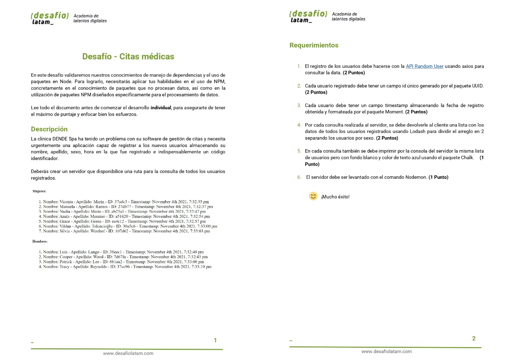
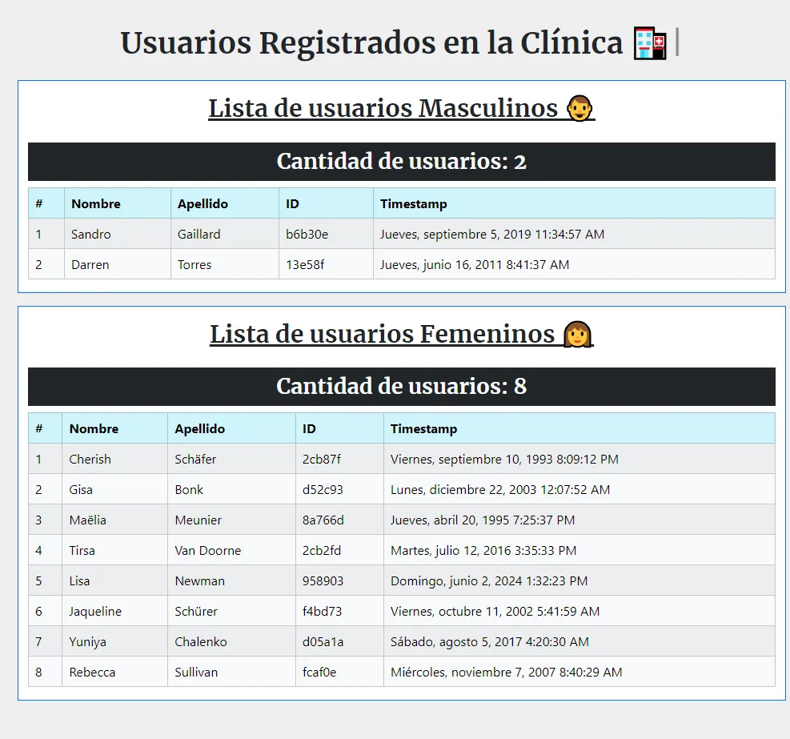
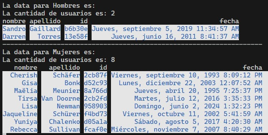

# Solución al desafío 4 Citas Médicas

Repositorio con el código solución al desafío 4 Citas médicas del módulo 6 **Desarrollo de aplicaciones web con Node y Express** de la beca **Desarrollo de aplicaciones Full Stack Javascript Trainee** dictado por Desafío Latam.

## Requisitos

Los requisitos del proyecto son los siguientes:



## Proyecto Finalizado

A continuación muestro un screenshot del proyecto finalizado:



## Librerias utilizadas

| #   | Dependencias Utilizadas |
| --- | ----------------------- |
| 1   | Express                 |
| 2   | Express-handlebars      |
| 3   | Bootstrap               |
| 4   | Axios                   |
| 5   | UUID                    |
| 6   | Moment                  |
| 7   | Lodash                  |
| 8   | Chalk                   |
| 9   | Nodemon                 |
| 10  | Typewriter-effect       |

## Soluciones

### 1.El registro de los usuarios debe hacerse con la API Random User usando axios para consultar la data. (2 Puntos)

Para ello he construido el siguiente middleware:

```js
const registrarUsuarios = async (req, res, next) => {
  try {
    const response = await axios.get("https://randomuser.me/api/?results=10");

    const data = response.data;
    const dataFormateada = formatearUsuario(data.results);
    const partitionMaleFemale = _.partition(dataFormateada, function (user) {
      return user.sexo == "male";
    });
    res.locals.datamale = partitionMaleFemale[0];
    res.locals.datafemale = partitionMaleFemale[1];
    mostrarEnConsolaConEstilos(partitionMaleFemale[0], "Hombres");
    mostrarEnConsolaConEstilos(partitionMaleFemale[1], "Mujeres");
    res.render("inicio");
  } catch (error) {
    next(error);
  }
};
```

### 2.Cada usuario registrado debe tener un campo id único generado por el paquete UUID. (2 Puntos)

Para resolver lo pedido he utilizado la librería **UUID** en la siguiente función que formatea la data de los usuarios:

```js
function formatearUsuario(data) {
  const dataFormateada = data.map((item) => {
    return {
      name: item.name.first,
      lastname: item.name.last,
      id: uuidv4().slice(0, 6),
      date: crearRandomDate(),
      sexo: item.gender,
    };
  });
  return dataFormateada;
}
```

### 3. Cada usuario debe tener un campo timestamp almacenando la fecha de registro obtenida y formateada por el paquete Moment. (2 Puntos)

Para ello he creado la siguiente función la cual crea una fecha aleatoria entre los años 1990 y 2024 junto con hora, minutos y segundos aleatorios para luego formatear dicha fecha como string usando **momentjs**:

```js
function crearRandomDate() {
  const añoMinimo = 1990;
  const añoMaximo = 2024;

  const year =
    Math.floor(Math.random() * (añoMaximo - añoMinimo + 1)) + añoMinimo;

  const month = Math.floor(Math.random() * 12);

  const day = Math.floor(Math.random() * 28) + 1;

  const hora = Math.floor(Math.random() * 24);

  const minuto = Math.floor(Math.random() * 60);

  const segundo = Math.floor(Math.random() * 60);

  const fecha = moment(
    new Date(year, month, day, hora, minuto, segundo)
  ).format("dddd, MMMM D, YYYY h:mm:ss A");
  const fechaFormateada = fecha.charAt(0).toUpperCase() + fecha.slice(1);
  return fechaFormateada == "Fecha inválida"
    ? "Jueves, noviembre 16, 2023 9:38:13 PM"
    : fechaFormateada;
}
```

### 4.Por cada consulta realizada al servidor, se debe devolverle al cliente una lista con los datos de todos los usuarios registrados usando Lodash para dividir el arreglo en 2 separando los usuarios por sexo. (2 Puntos)

En la función **registrarUsuarios** divido la data usando la librería **lodash** en dos grupos: masculino y femenino, luego hago disponible esa data a la vista **inicio**:

```js
const partitionMaleFemale = _.partition(dataFormateada, function (user) {
  return user.sexo == "male";
});
res.locals.datamale = partitionMaleFemale[0];
res.locals.datafemale = partitionMaleFemale[1];
```

En la vista **inicio** renderizo dicha data en una tabla. A continuación muestro el body de la tabla en la que muestro la data para el sexo masculino:

```hbs
<tbody>
  {{#each datamale}}
    <tr>
      <td>{{{indexPlusOne @index}}}</td>
      <td>{{this.name}}</td>
      <td>{{this.lastname}}</td>
      <td>{{this.id}}</td>
      <td>{{this.date}}</td>
    </tr>
  {{/each}}
</tbody>
```

### 5.En cada consulta también se debe imprimir por la consola del servidor la misma lista de usuarios pero con fondo blanco y color de texto azul usando el paquete Chalk. (1 Punto)

Para resolver lo pedido he creado las siguientes funciones:

```js
function mostrarEnConsolaConEstilos(data, sexo) {
  const maximos = maximoLargoPropiedaddeArraydeObjetos(data);
  console.log(
    "-".repeat(Object.values(maximos).reduce((a, b) => a + b, 0)) + "---"
  );
  console.log(`La data para ${sexo} es:`);
  console.log(`La cantidad de usuarios es: ${data.length}`);
  console.log(
    "nombre".padStart(maximos.name, " "),
    "apellido".padStart(maximos.lastname, " "),
    "id".padStart(maximos.id, " "),
    "fecha".padStart(maximos.date, " ")
  );
  const estilos = chalk.blue.bgWhite;

  data.forEach((obj) => {
    const { name, lastname, id, date } = obj;
    const arrayEstilos = Object.values({ name, lastname, id, date }).map(
      (value, index) => {
        switch (index) {
          case 0:
            return estilos(value.padStart(maximos.name, " "));
          case 1:
            return estilos(value.padStart(maximos.lastname, " "));
          case 2:
            return estilos(value.padStart(maximos.id, " "));
          case 3:
            return estilos(value.padStart(maximos.date, " "));
        }
      }
    );
    console.log(...arrayEstilos);
  });
}
```

```js
function maximoLargoPropiedaddeArraydeObjetos(array) {
  const maximos = { name: null, lastname: null, id: null, date: null };

  Object.keys(maximos).forEach((key) => {
    const arrayValuesForKey = array.map((obj) => obj[key]);
    arrayValuesForKey.push(key);
    maximos[key] = _.maxBy(arrayValuesForKey, (str) => str.length).length;
  });
  return maximos;
}
```

La primera función aplica estilos a los elementos del array uno a uno para luego mostrarlos por consola. La segunda función calcula el largo máximo para cada valor de cada atributo y lo utilizo en la primera función para **definir anchos fijos por atributo**.

El resultado mostrado por consola es el siguiente:



### 6.El servidor debe ser levantado con el comando Nodemon. (1 Punto)

El servidor lo levanto en modo de desarrollo usando **Nodemon**:

```js
{
"scripts": {
    "start": "node api/index.js",
    "server": "nodemon api/index.js",
    "test": "echo \"Error: no test specified\" && exit 1"
  },
}
```

Ya que he instalado Nodemon como dependencia de desarrollo:

```js
{
"devDependencies": {
    "nodemon": "^3.1.0"
  }
}
```
